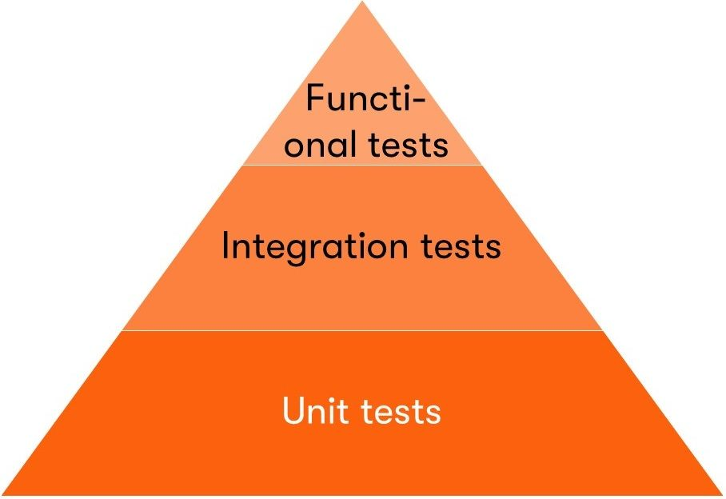

# 🍎 Testes de unidade 
### Testes de unidade são feitos em um nível muito baixo, próximo ao código-fonte do aplicativo. Eles consistem em testar métodos e funções individuais de classes, componentes ou módulos usados pelo software.

# 🍎 Testes de integração
### Testes de integração verificam se diferentes módulos ou serviços usados pelo seu aplicativo funcionam bem juntos. Por exemplo, pode ser testar a interação com o banco de dados ou garantir que os microsserviços funcionem juntos conforme o esperado.

# 👍 Testes funcionais
### Os testes funcionais têm como foco os requisitos de negócios de uma aplicação. Eles só verificam a saída de uma ação e não verificam os estados intermediários do sistema ao executar essa ação.

Feito por Monique 
